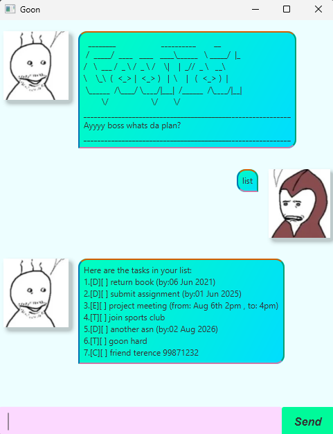

# GoonBot User Guide



## Overview
Welcome to **GoonBot**! This simple chatbot helps fellow `G00n3rs`to track their tasks, classifiable into ToDos, Deadlines and Events. You may also track contacts here!
## Installation

### Prerequisites
Ensure you have the following installed:
- Java (JDK 17 or later)
- JavaFX (if using a GUI version)

### Steps
1. Clone this repository:
   ```sh
   git clone https://github.com/fieash/ip.git
   ```
2. launch the project with IntelliJ
    * Open the project into Intellij as follows:
    * Click `Open`.
    * Select the project directory, and click `OK`.
    * If there are any further prompts, accept the defaults.
    * Configure the project to use **JDK 17** (not other versions) as explained in [here](https://www.jetbrains.com/help/idea/sdk.html#set-up-jdk).<br>
    * In the same dialog, set the **Project language level** field to the `SDK default` option.
3. Run the Launcher class
4. Use the GoonBot!


## Usage

### CLI Version
- To use the CLI version, run the `Main` class
- Once the GoonBot is running, you can interact by typing commands into the terminal.

**Example Commands:**
- `bye` → Exits the chatbot.
- `list` → Displays all tasks
- `todo Buy groceries` → Adds a to-do item.
- `event Meeting /from Monday /to Wednesday` → Adds an event.
- `deadline Submit report /by 2025-02-20` → Adds a deadline.
- `contact close friend /name john /phone 91271023` → Adds a contact.
- `mark 1` → Marks Task 1 as done.
- `unmark 1` → Unmarks Task 1.
- `delete 1` → Deletes Task 1.

### GUI Version (if applicable)
If you're using the JavaFX GUI, simply type into the input box and press the Enter key to interact with GoonBot.

## Features
- Simple text-based interaction.
- Task management (ToDo, Deadline, Event, Contacts).
- Persistent storage of tasks.
- JavaFX GUI support.


---

## **Commands**

| **Command** | **Description**                                  | **Format**                                                | **Example**                                |
|------------|--------------------------------------------------|-----------------------------------------------------------|--------------------------------------------|
| `bye`      | Exits the application.                           | `bye`                                                     | `bye`                                      |
| `list`     | Lists all tasks in your current task list.       | `list`                                                    | `list`                                     |
| `todo`     | Adds a ToDo task.                                | `todo <description>`                                      | `todo Buy groceries`                       |
| `event`    | Adds an Event task.                              | `event <description> /from <time> /to <time>`             | `event Meeting /from Monday /to Wednesday` |
| `deadline` | Adds a Deadline task.                            | `deadline <description> /by <date>`                       | `deadline Submit report /by 2025-02-20`    |
| `deadline` | Adds a Deadline task.                            | `contact <description> /name <name> /phone <phone number>` | `contact close friend /name john /phone 91271023`    |
| `mark`     | Marks a task as done.                            | `mark <task number>`                                      | `mark 1`                                   |
| `unmark`    | Marks a task as UNdone.                           | `unmark <task number>`                                    | `unmark 1`                                 |
| `delete`   | Deletes a task from the list.                    | `delete <task number>`                                    | `delete 1`                                 |
                          |


## Troubleshooting
- **Java not found?** Ensure Java is installed and added to your system PATH.
- **GUI not launching?** Ensure JavaFX is installed and correctly configured.
- **Command not recognized?** Try using `help` for a list of commands.

## Contributing
Feel free to fork the repository and submit pull requests for improvements.

## License
This project is licensed under the MIT License.

